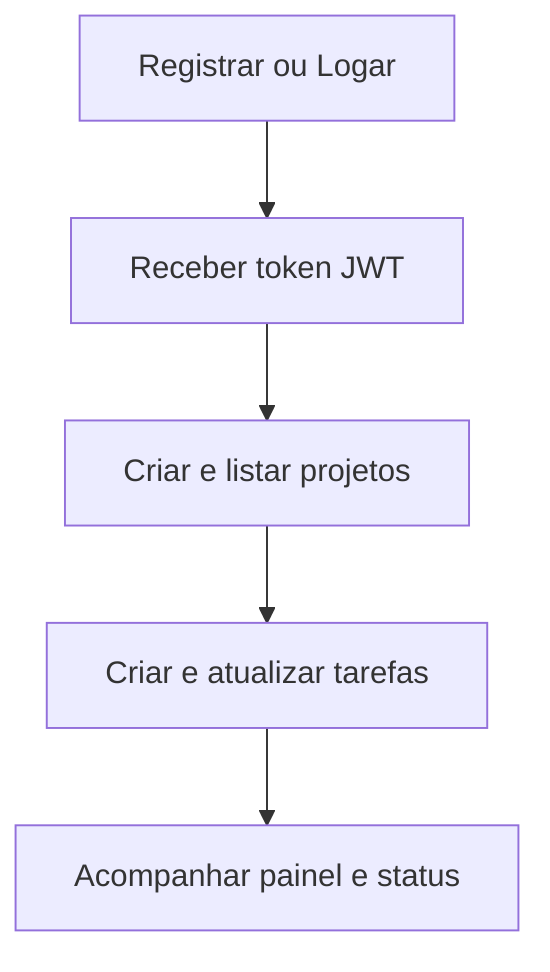

# Desafio Fullstack Lotus

Aplicação fullstack Todo list.

## O que voce encontra aqui
- Backend com API REST, autenticação JWT e persistência em H2.
- Frontend React para login, cadastro, projetos, tarefas e dashboard.
- Ambiente local rápido com Docker Compose.

## Arquitetura (visao geral)


## Fluxo principal



## Stack
- Backend: Spring Boot 3, Spring Security, Spring Data JPA, Lombok
- Banco: H2
- Auth: JWT e BCrypt
- Frontend: React e Vite
- Containers: Docker Compose

## Requisitos
- Java 17+
- Node 18+
- Docker e Docker Compose (opcional)

## Estrutura
- backend/lotus: API Spring Boot
- frontend: aplicacao React
- docs: guia de uso e coleção Insomnia

## Rodar com Docker (mais simples)
Na raiz do projeto:

```bash
docker compose up -d --build
```

Endpoints uteis:
- Frontend: http://localhost:5173
- Backend: http://localhost:8080
- Swagger: http://localhost:8080/swagger-ui/index.html

## Rodar local sem Docker

Backend:

```powershell
cd backend/lotus
.\mvnw.cmd spring-boot:run
```

Frontend:

```powershell
cd frontend
npm install
npm run dev
```

## Testes
Backend:

```powershell
cd backend/lotus
.\mvnw.cmd test
```

## Documentacao adicional
- Guia: docs/README.md
- Insomnia: docs/insomnia-lotus.json
