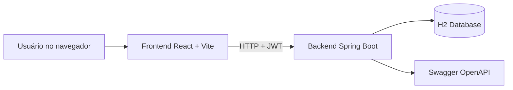
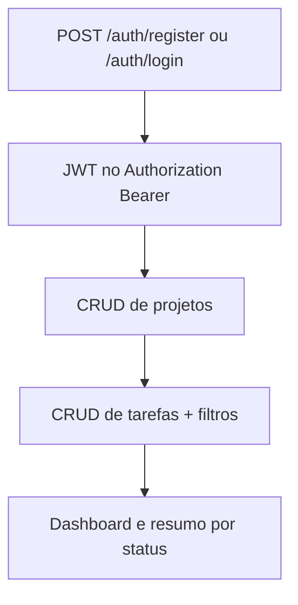

# Desafio Fullstack Lotus

Solução fullstack para gerenciamento de usuários, projetos e tarefas, desenvolvida para o Processo Seletivo 2026.1 da Lotus Tech.

## Objetivo do projeto
- Backend REST com autenticação JWT, regras de acesso e validação de dados.
- Frontend React consumindo a API real (sem dados mockados).
- Entrega simples de executar localmente, com opção via Docker.

## Stack e justificativa técnica

### Backend
- Java 17 + Spring Boot 3
: base sólida para API enterprise, produtividade alta e ecossistema maduro.
- Spring Security + JWT
: autenticação stateless, proteção de rotas e integração limpa com filtros.
- BCrypt
: hash de senha seguro e padrão de mercado.
- Spring Data JPA + Hibernate
: persistência com baixo boilerplate e suporte a queries dinâmicas.
- H2 em arquivo
: ambiente sem setup complexo para avaliação técnica rápida.
- Springdoc OpenAPI
: facilita validação funcional dos endpoints (Swagger UI).

### Frontend
- React + Vite
: iteração rápida, build eficiente e boa experiência de desenvolvimento.
- Zustand
: gerenciamento de estado leve para autenticação e sessão.
- Axios
: interceptors para token JWT e padronização de erros.
- Tailwind CSS
: construção rápida de UI responsiva com componentes reutilizáveis.
- Vitest + React Testing Library
: testes rápidos e alinhados com o ecossistema Vite.

## Arquitetura





## Padrões adotados

### Backend
- Controller fino: recebe request, valida, delega ao service.
- Service com regra de negócio e autorização.
- DTOs de request/response separados das entidades.
- Exceções centralizadas em handler global com payload consistente.
- JSON em snake_case para alinhar contrato da API.

### Frontend
- Páginas compostas por componentes reutilizáveis de UI.
- Camada de API única em services/api.js (sem fetch espalhado).
- Interceptor para anexar token e tratar 401.
- Formulários com validação e mensagens por campo.

## Estrutura do repositório
- backend/lotus: API Spring Boot
- frontend: aplicação React
- docs: guia adicional e coleção Insomnia

## Pré-requisitos
- Java 17+
- Node 18+
- Docker e Docker Compose (opcional)

## Variáveis de ambiente
- backend/lotus/.env.example
- frontend/.env.example

## Como rodar

### Opção 1 (recomendada): Docker
Na raiz do projeto:

```bash
docker compose up -d --build
```

### Opção 2: ambiente local
Backend:

```powershell
cd backend/lotus
.\mvnw.cmd spring-boot:run
```

Se a porta 8080 estiver ocupada, use uma porta alternativa:

```powershell
.\mvnw.cmd spring-boot:run -Dspring-boot.run.arguments="--server.port=8081"
```

Frontend:

```powershell
cd frontend
npm install
npm run dev
```

## Endpoints úteis
- Frontend: http://localhost:5173
- API: http://localhost:8080
- Swagger UI: http://localhost:8080/swagger-ui/index.html
- OpenAPI JSON: http://localhost:8080/v3/api-docs

Observação: para execução local sem Docker, o backend está configurado para não subir containers automaticamente via Spring Docker Compose, evitando conflito de porta.

## Testes

Backend:

```powershell
cd backend/lotus
.\mvnw.cmd test
```

Frontend:

```powershell
cd frontend
npm test
```

## Checklist de requisitos (status atual)

### Backend
- [x] Auth com register/login/me/logout
- [x] JWT com expiração configurada
- [x] Senha com BCrypt
- [x] Rotas protegidas por token
- [x] CRUD de usuários
- [x] CRUD de projetos
- [x] GET /projects/:id/tasks
- [x] GET /projects/:id/summary
- [x] CRUD de tarefas
- [x] PATCH /tasks/:id/status
- [x] Filtros em GET /tasks (status, priority, project_id, due_date)
- [x] Tratamento global de erros
- [x] Status HTTP semânticos (200/201/204/400/401/403/404/500)
- [x] .env.example presente
- [x] Swagger/OpenAPI disponível
- [x] Testes de service/controller passando
- [x] Docker Compose funcional

### Frontend
- [x] Login e cadastro integrados à API real
- [x] Rotas protegidas por autenticação
- [x] CRUD de projetos
- [x] CRUD de tarefas
- [x] Atualização inline de status de tarefa
- [x] Filtros de tarefas (status, priority, project, due_date)
- [x] Dashboard com resumo por status
- [x] Dashboard com tarefas próximas do prazo
- [x] Indicação visual de projeto compartilhado
- [x] Layout responsivo com navegação mobile
- [x] Componentes reutilizáveis de UI
- [x] Testes de componentes com Vitest + RTL
- [x] .env.example presente
- [x] Sistema de toast global para feedback

### Entrega e processo
- [x] README com justificativa de stack e instruções de execução
- [x] Separação de responsabilidades por camadas
- [x] Sem arquivos sensíveis (.env real) versionados
- [x] Sem artefatos de build desnecessários versionados
- [ ] Revisar histórico final para garantir 100% de commits atômicos e mensagens ideais

## Documentação complementar
- docs/README.md
- docs/insomnia-lotus.json